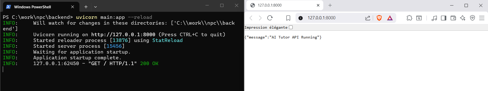
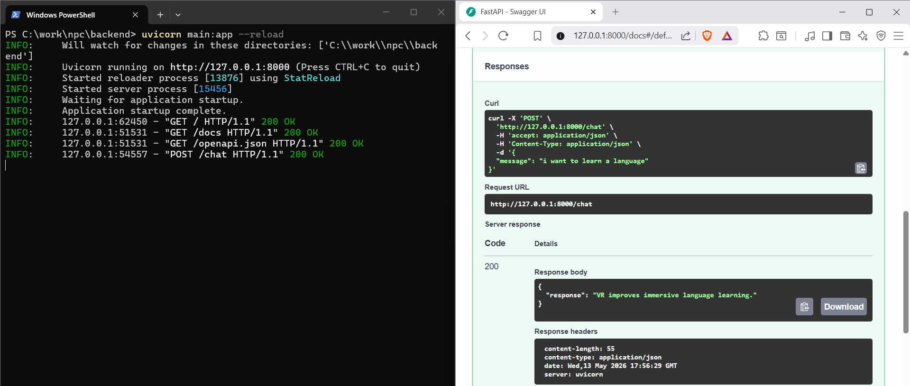
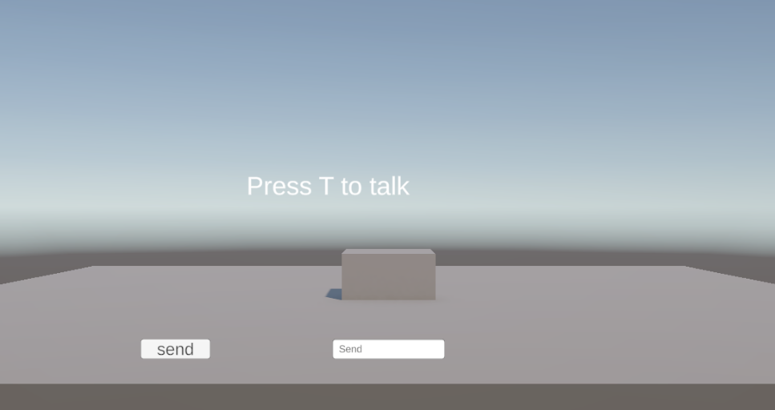
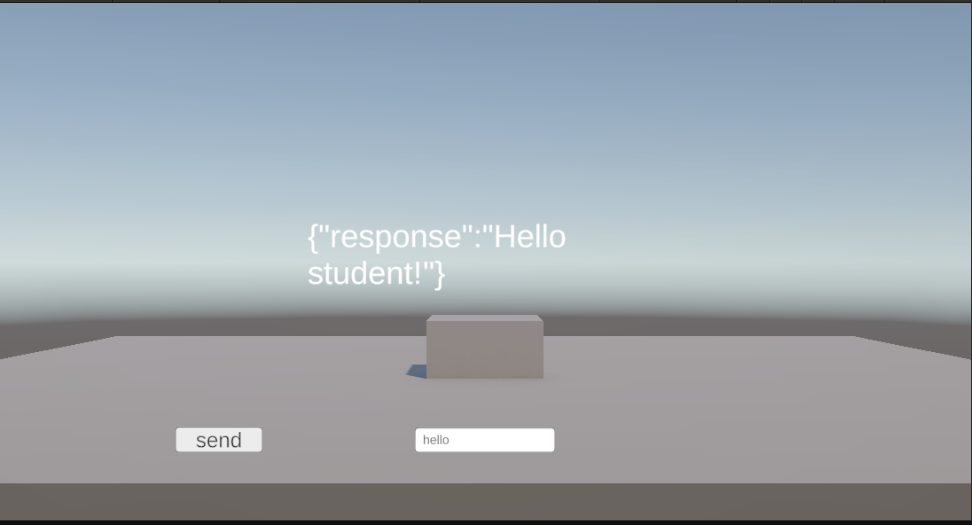
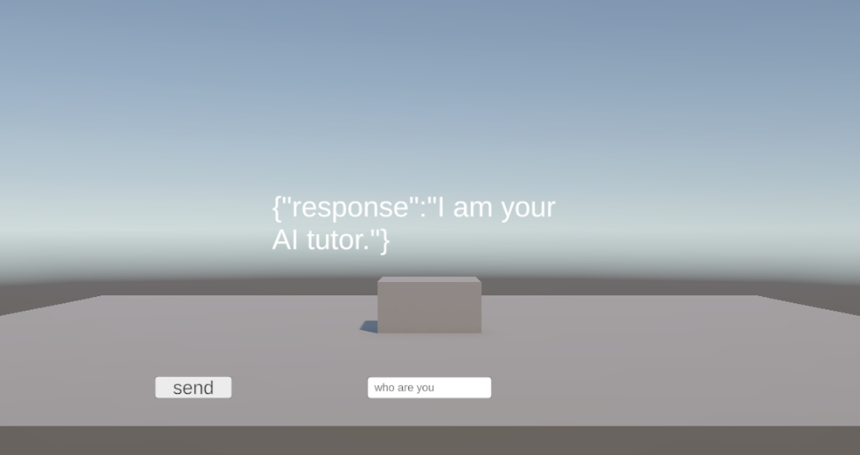
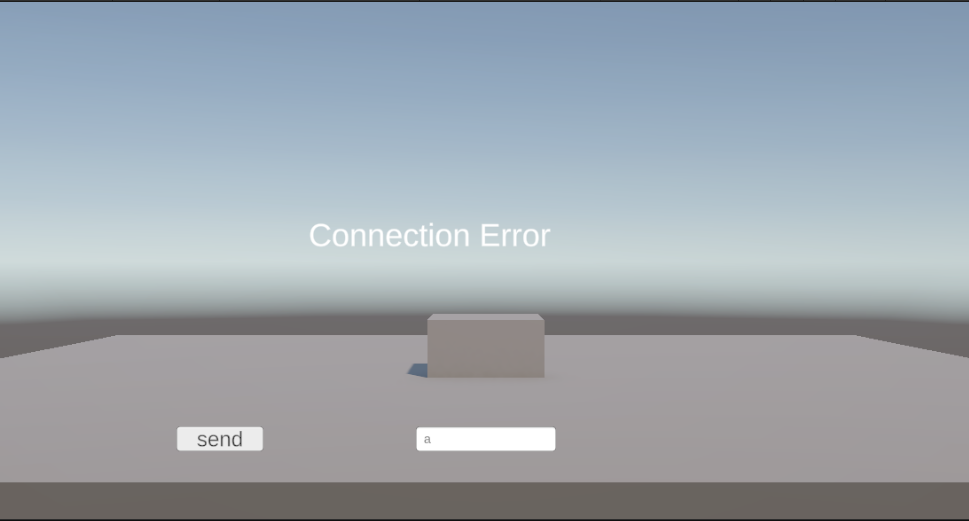

# AI-Talking-NPC

### Moving the cube
## move right or left

##
### Testing the API 

#### GET

#### POST

##
###  How it looks like 

#### the start / default state 

#### hello_reponse

#### Defult_response

#### Connection_Error

